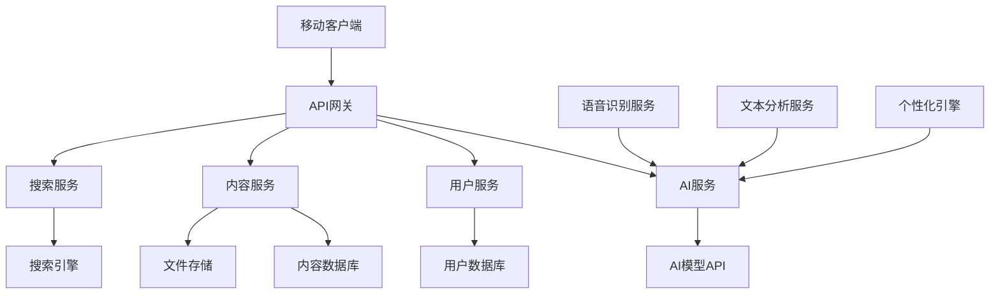
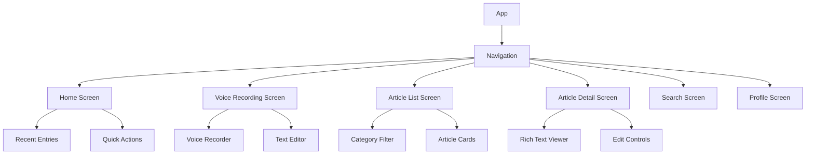
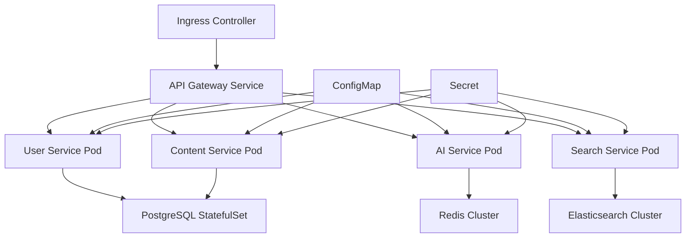

# 笔心 · InkSoul 设计文档

## 概述

笔心 · InkSoul 是一款基于AI的智能个人日记应用，采用现代移动应用架构设计。应用将语音识别、自然语言处理、智能分类和个性化AI对话等技术整合，为用户提供智能化的个人记录和写作体验。

## 架构设计

### 整体架构



### 技术栈选择

**移动端：**
- React Native - 跨平台开发，代码复用率高
- TypeScript - 类型安全，提高代码质量
- Redux Toolkit - 状态管理
- React Navigation - 路由导航
- Expo - 开发工具链

**后端：**
- Java 8 + Spring Boot - 企业级稳定性和性能
- Spring Security - 安全认证和授权
- Spring Data JPA - 数据访问层
- PostgreSQL - 关系型数据存储
- Redis - 缓存和会话管理
- Elasticsearch - 全文搜索
- Kubernetes - 容器编排和部署

**AI服务：**
- 语音识别：Azure Speech Services / Google Speech-to-Text
- 自然语言处理：OpenAI GPT-4 / 自定义模型
- 文本分析：自研算法 + 预训练模型

## 组件和接口

### 移动端组件架构



### 核心组件设计

#### 1. 语音记录组件 (VoiceRecorder)
```typescript
interface VoiceRecorderProps {
  onRecordingComplete: (audioFile: File) => void;
  onTranscriptionReceived: (text: string) => void;
  maxDuration?: number;
}

interface VoiceRecorderState {
  isRecording: boolean;
  duration: number;
  transcription: string;
  isProcessing: boolean;
}
```

#### 2. 智能编辑器组件 (SmartEditor)
```typescript
interface SmartEditorProps {
  initialContent: string;
  onContentChange: (content: string) => void;
  onPolishRequest: () => void;
  aiSuggestions?: AISuggestion[];
}

interface AISuggestion {
  type: 'polish' | 'categorize' | 'relate';
  content: string;
  confidence: number;
}
```

#### 3. 文章生成器组件 (ArticleGenerator)
```typescript
interface ArticleGeneratorProps {
  searchQuery: string;
  relatedEntries: DiaryEntry[];
  style: 'chronological' | 'biographical';
  onArticleGenerated: (article: GeneratedArticle) => void;
}
```

### API接口设计

#### 用户认证接口
```java
// POST /api/auth/login
@PostMapping("/api/auth/login")
public class LoginRequest {
    private String email;
    private String password;
    // getters and setters
}

public class LoginResponse {
    private String token;
    private UserProfile user;
    private long expiresIn;
    // getters and setters
}
```

#### 内容管理接口
```java
// POST /api/entries
@PostMapping("/api/entries")
public class CreateEntryRequest {
    private String content;
    private MultipartFile audioFile;
    private List<String> tags;
    private String category;
    // getters and setters
}

// GET /api/entries/search
@GetMapping("/api/entries/search")
public class SearchRequest {
    private String query;
    private String category;
    private DateRange dateRange;
    private Boolean generateArticle;
    // getters and setters
}
```

#### AI服务接口
```java
// POST /api/ai/transcribe
@PostMapping("/api/ai/transcribe")
public class TranscribeRequest {
    private MultipartFile audioFile;
    private String language;
    // getters and setters
}

// POST /api/ai/polish
@PostMapping("/api/ai/polish")
public class PolishRequest {
    private String text;
    private String style; // 'formal' | 'casual' | 'literary'
    private UserPreferences userPreferences;
    // getters and setters
}

// POST /api/ai/categorize
@PostMapping("/api/ai/categorize")
public class CategorizeRequest {
    private String content;
    private List<String> existingCategories;
    // getters and setters
}
```

## 数据模型

### 用户模型
```typescript
interface User {
  id: string;
  email: string;
  username: string;
  profile: UserProfile;
  preferences: UserPreferences;
  createdAt: Date;
  updatedAt: Date;
}

interface UserProfile {
  displayName: string;
  avatar?: string;
  bio?: string;
  timezone: string;
}

interface UserPreferences {
  writingStyle: 'formal' | 'casual' | 'literary';
  aiPersonality: AIPersonality;
  privacySettings: PrivacySettings;
  notificationSettings: NotificationSettings;
}

interface AIPersonality {
  traits: string[];
  communicationStyle: string;
  interests: string[];
  learningHistory: InteractionHistory[];
}
```

### 内容模型
```typescript
interface DiaryEntry {
  id: string;
  userId: string;
  content: string;
  originalContent?: string; // 润色前的原始内容
  audioFile?: string;
  category: string;
  tags: string[];
  mood?: string;
  location?: Location;
  createdAt: Date;
  updatedAt: Date;
  metadata: EntryMetadata;
}

interface EntryMetadata {
  wordCount: number;
  readingTime: number;
  aiAnalysis: AIAnalysis;
  relatedEntries: string[];
}

interface AIAnalysis {
  sentiment: 'positive' | 'negative' | 'neutral';
  topics: string[];
  entities: Entity[];
  personalityInsights: PersonalityInsight[];
}
```

### 文章模型
```typescript
interface GeneratedArticle {
  id: string;
  userId: string;
  title: string;
  content: string;
  style: 'chronological' | 'biographical';
  sourceEntries: string[];
  category: string;
  createdAt: Date;
  updatedAt: Date;
  isPublic: boolean;
}

interface ArticleUpdate {
  articleId: string;
  newEntries: string[];
  updateType: 'append' | 'integrate' | 'rewrite';
}
```

## 错误处理

### 错误分类和处理策略

#### 1. 网络错误
```typescript
class NetworkError extends Error {
  constructor(
    message: string,
    public statusCode: number,
    public retryable: boolean = true
  ) {
    super(message);
  }
}

// 重试机制
const retryConfig = {
  maxRetries: 3,
  backoffMultiplier: 2,
  initialDelay: 1000
};
```

#### 2. AI服务错误
```typescript
class AIServiceError extends Error {
  constructor(
    message: string,
    public service: 'transcription' | 'polish' | 'categorize',
    public fallbackAvailable: boolean = false
  ) {
    super(message);
  }
}

// 降级策略
const fallbackStrategies = {
  transcription: 'manual_input',
  polish: 'basic_grammar_check',
  categorize: 'keyword_matching'
};
```

#### 3. 数据验证错误
```typescript
interface ValidationError {
  field: string;
  message: string;
  code: string;
}

class DataValidationError extends Error {
  constructor(public errors: ValidationError[]) {
    super('Data validation failed');
  }
}
```

### 错误恢复机制

1. **离线模式支持**
   - 本地数据缓存
   - 离线操作队列
   - 网络恢复时自动同步

2. **优雅降级**
   - AI服务不可用时提供基础功能
   - 语音识别失败时支持手动输入
   - 搜索服务异常时使用本地搜索

3. **用户友好的错误提示**
   - 清晰的错误信息
   - 建议的解决方案
   - 重试和反馈选项

## 测试策略

### 测试金字塔

#### 1. 单元测试 (70%)
- 组件逻辑测试
- 工具函数测试
- API接口测试
- 数据模型验证测试

#### 2. 集成测试 (20%)
- API集成测试
- 数据库操作测试
- 第三方服务集成测试
- 端到端工作流测试

#### 3. UI测试 (10%)
- 关键用户流程测试
- 跨平台兼容性测试
- 性能测试
- 可访问性测试

### 测试工具和框架

**移动端测试：**
- Jest - 单元测试框架
- React Native Testing Library - 组件测试
- Detox - E2E测试
- Flipper - 调试和性能分析

**后端测试：**
- JUnit 5 - 单元测试框架
- Spring Boot Test - 集成测试
- TestContainers - 数据库测试隔离
- MockMvc - API测试
- Docker - 测试环境隔离

### AI功能测试策略

#### 1. 语音识别测试
```typescript
describe('Voice Recognition', () => {
  test('should transcribe clear speech accurately', async () => {
    const audioFile = loadTestAudio('clear_speech.wav');
    const result = await transcribeAudio(audioFile);
    expect(result.accuracy).toBeGreaterThan(0.95);
  });

  test('should handle noisy audio gracefully', async () => {
    const audioFile = loadTestAudio('noisy_speech.wav');
    const result = await transcribeAudio(audioFile);
    expect(result.confidence).toBeDefined();
  });
});
```

#### 2. 内容分类测试
```typescript
describe('Content Categorization', () => {
  test('should categorize travel content correctly', async () => {
    const content = "今天去了北京，参观了故宫...";
    const category = await categorizeContent(content);
    expect(category).toBe('travel');
  });
});
```

#### 3. 个性化测试
```typescript
describe('Personalization Engine', () => {
  test('should adapt to user writing style', async () => {
    const userHistory = loadUserHistory('formal_writer');
    const response = await generatePersonalizedResponse(
      "帮我润色这段文字",
      userHistory
    );
    expect(response.style).toBe('formal');
  });
});
```

### 性能测试

#### 1. 响应时间要求
- 语音转文字：< 3秒
- 文本润色：< 2秒
- 搜索响应：< 1秒
- 文章生成：< 5秒

#### 2. 并发处理能力
- 支持1000+并发用户
- AI服务请求队列管理
- 数据库连接池优化

#### 3. 存储和带宽优化
- 音频文件压缩
- 图片懒加载
- 内容分页加载
- CDN加速

### 安全测试

#### 1. 数据安全
- 用户数据加密存储
- API接口安全验证
- 敏感信息脱敏处理

#### 2. 隐私保护
- 用户同意机制
- 数据删除功能
- 匿名化处理

#### 3. 接口安全
- 请求频率限制
- 输入验证和过滤
- SQL注入防护

## Kubernetes部署架构

### 集群架构设计



### 核心Kubernetes资源

#### 1. Deployment配置
```yaml
apiVersion: apps/v1
kind: Deployment
metadata:
  name: ink-soul-api
spec:
  replicas: 3
  selector:
    matchLabels:
      app: ink-soul-api
  template:
    metadata:
      labels:
        app: ink-soul-api
    spec:
      containers:
      - name: api
        image: ink-soul/api:latest
        ports:
        - containerPort: 8080
        env:
        - name: SPRING_PROFILES_ACTIVE
          value: "kubernetes"
        - name: DATABASE_URL
          valueFrom:
            secretKeyRef:
              name: database-secret
              key: url
        resources:
          requests:
            memory: "512Mi"
            cpu: "250m"
          limits:
            memory: "1Gi"
            cpu: "500m"
        livenessProbe:
          httpGet:
            path: /actuator/health
            port: 8080
          initialDelaySeconds: 60
          periodSeconds: 30
        readinessProbe:
          httpGet:
            path: /actuator/health/readiness
            port: 8080
          initialDelaySeconds: 30
          periodSeconds: 10
```

#### 2. Service配置
```yaml
apiVersion: v1
kind: Service
metadata:
  name: ink-soul-api-service
spec:
  selector:
    app: ink-soul-api
  ports:
  - protocol: TCP
    port: 80
    targetPort: 8080
  type: ClusterIP
```

#### 3. ConfigMap配置
```yaml
apiVersion: v1
kind: ConfigMap
metadata:
  name: ink-soul-config
data:
  application.yml: |
    server:
      port: 8080
    spring:
      datasource:
        driver-class-name: org.postgresql.Driver
      jpa:
        hibernate:
          ddl-auto: validate
        show-sql: false
      redis:
        host: redis-service
        port: 6379
    ai:
      services:
        openai:
          base-url: https://api.openai.com/v1
        azure:
          speech:
            region: eastus
    logging:
      level:
        com.inksoul: INFO
```

#### 4. Secret配置
```yaml
apiVersion: v1
kind: Secret
metadata:
  name: database-secret
type: Opaque
data:
  url: <base64-encoded-database-url>
  username: <base64-encoded-username>
  password: <base64-encoded-password>
---
apiVersion: v1
kind: Secret
metadata:
  name: ai-api-keys
type: Opaque
data:
  openai-key: <base64-encoded-openai-key>
  azure-key: <base64-encoded-azure-key>
```

### 数据持久化

#### PostgreSQL StatefulSet
```yaml
apiVersion: apps/v1
kind: StatefulSet
metadata:
  name: postgresql
spec:
  serviceName: postgresql-service
  replicas: 1
  selector:
    matchLabels:
      app: postgresql
  template:
    metadata:
      labels:
        app: postgresql
    spec:
      containers:
      - name: postgresql
        image: postgres:13
        env:
        - name: POSTGRES_DB
          value: inksoul
        - name: POSTGRES_USER
          valueFrom:
            secretKeyRef:
              name: database-secret
              key: username
        - name: POSTGRES_PASSWORD
          valueFrom:
            secretKeyRef:
              name: database-secret
              key: password
        ports:
        - containerPort: 5432
        volumeMounts:
        - name: postgresql-storage
          mountPath: /var/lib/postgresql/data
  volumeClaimTemplates:
  - metadata:
      name: postgresql-storage
    spec:
      accessModes: ["ReadWriteOnce"]
      resources:
        requests:
          storage: 20Gi
```

### 监控和日志

#### 1. Prometheus监控
```yaml
apiVersion: v1
kind: ServiceMonitor
metadata:
  name: ink-soul-metrics
spec:
  selector:
    matchLabels:
      app: ink-soul-api
  endpoints:
  - port: http
    path: /actuator/prometheus
```

#### 2. 日志收集
```yaml
apiVersion: v1
kind: ConfigMap
metadata:
  name: fluent-bit-config
data:
  fluent-bit.conf: |
    [INPUT]
        Name tail
        Path /var/log/containers/*ink-soul*.log
        Parser docker
        Tag kube.*
    [OUTPUT]
        Name elasticsearch
        Match kube.*
        Host elasticsearch-service
        Port 9200
        Index ink-soul-logs
```

### 扩展和优化

#### 1. 水平Pod自动扩展
```yaml
apiVersion: autoscaling/v2
kind: HorizontalPodAutoscaler
metadata:
  name: ink-soul-api-hpa
spec:
  scaleTargetRef:
    apiVersion: apps/v1
    kind: Deployment
    name: ink-soul-api
  minReplicas: 2
  maxReplicas: 10
  metrics:
  - type: Resource
    resource:
      name: cpu
      target:
        type: Utilization
        averageUtilization: 70
  - type: Resource
    resource:
      name: memory
      target:
        type: Utilization
        averageUtilization: 80
```

#### 2. 网络策略
```yaml
apiVersion: networking.k8s.io/v1
kind: NetworkPolicy
metadata:
  name: ink-soul-network-policy
spec:
  podSelector:
    matchLabels:
      app: ink-soul-api
  policyTypes:
  - Ingress
  - Egress
  ingress:
  - from:
    - podSelector:
        matchLabels:
          app: nginx-ingress
    ports:
    - protocol: TCP
      port: 8080
  egress:
  - to:
    - podSelector:
        matchLabels:
          app: postgresql
    ports:
    - protocol: TCP
      port: 5432
```

### 部署流程

#### 1. CI/CD Pipeline
```yaml
# .github/workflows/deploy.yml
name: Deploy to Kubernetes
on:
  push:
    branches: [main]
jobs:
  deploy:
    runs-on: ubuntu-latest
    steps:
    - uses: actions/checkout@v2
    - name: Build Docker Image
      run: |
        docker build -t ink-soul/api:${{ github.sha }} .
        docker push ink-soul/api:${{ github.sha }}
    - name: Deploy to K8s
      run: |
        kubectl set image deployment/ink-soul-api api=ink-soul/api:${{ github.sha }}
        kubectl rollout status deployment/ink-soul-api
```

#### 2. 环境管理
- **开发环境**: Minikube或Kind本地集群
- **测试环境**: 单节点K8s集群，资源限制
- **生产环境**: 多节点高可用集群，完整监控